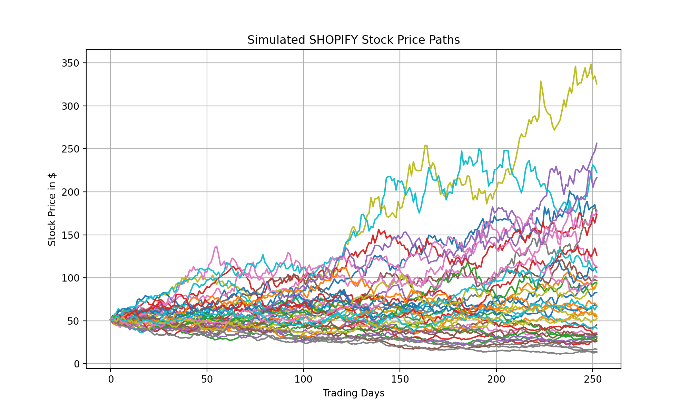

# Monte Carlo Stock Predictor
Shopify stock predictor using Monte Carlo simulation

Modify 'threshold' variable on line 30 to see the likelihood of Shopify stock exceeding the given amount in the next year.

Simulation runs for 252 trading days.

Data is obtained from Yahoo Finance as of 2023/10/15

